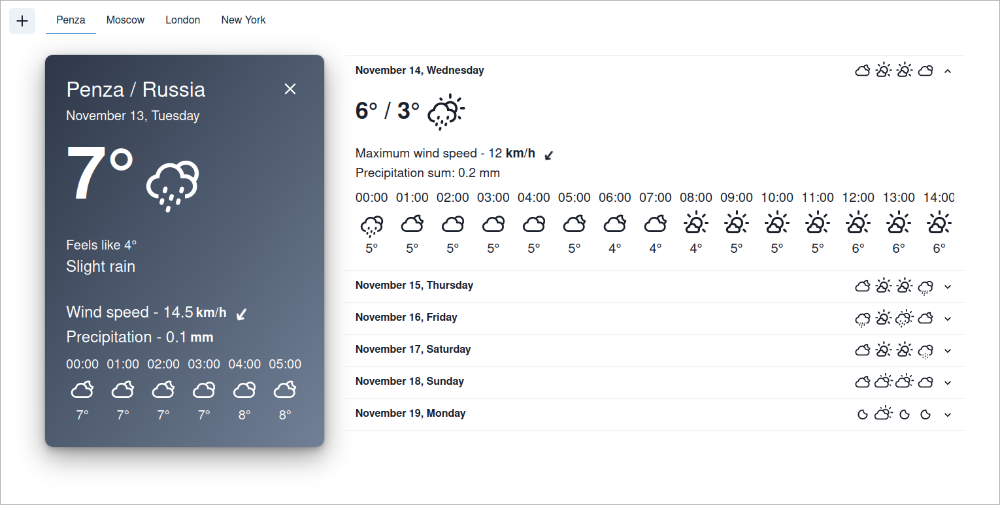

# OpenWE

OpenWE это мини-проект, написанный в качестве контрольного задания для лаборатории Айтеко на первый семестр.

Опробовать сайт можно [здесь](https://katsuki.codeberg.page/openwe)

Данный сайт представляет собой простенький одностраничник, отображающий погоду, получаемую из Open Meteo API. Написан продукт на React + TypeScript.

## Использованные API

* [Open Meteo Weather API](https://open-meteo.com/en/docs) - Открытое REST API, предоставляющее данные о прогнозе погоды на заданный промежуток времени (на неделю вперед, по умолчанию).
* [Open Meteo Geocoding API](https://open-meteo.com/en/docs/geocoding-api) - Открытое REST API, позволяющее осуществлять поиск данных о городе по его названию.

## Использованные библиотеки / фреймворки

* [Chakra-UI](https://chakra-ui.com/) - библиотека UI компонентов.
* [React-icons](https://react-icons.github.io/react-icons/) - сборник SVG иконок, адаптированных под использование среди React компонентов.
* [React-query](https://tanstack.com/query/latest/) - state management фреймворк, облегчающий хранение и обработку данный, полученных от api.
* [Zustand](https://zustand-demo.pmnd.rs/) - state management библиотека, являющаяся более легкой альтернативой React Redux, позволяющая писать множественные гибкие сторы для хранения данных без обилия бойлерплейта.

> Вместе с zustand использовалась библиотека immer для создания изменяемого стора.

## Сборка

Сборка продукта производится стандартным NPM

```
git clone https://codeberg.org/katsuki/openwe 
cd openwe 
npm install 
npm run build
```

## Скриншот


